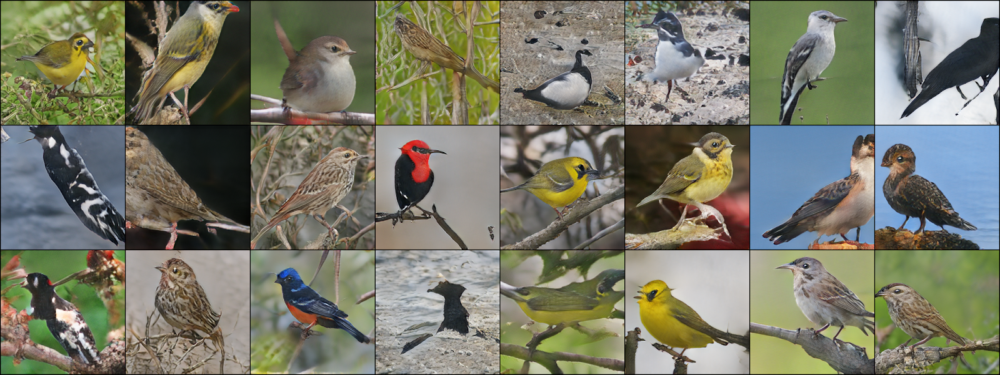
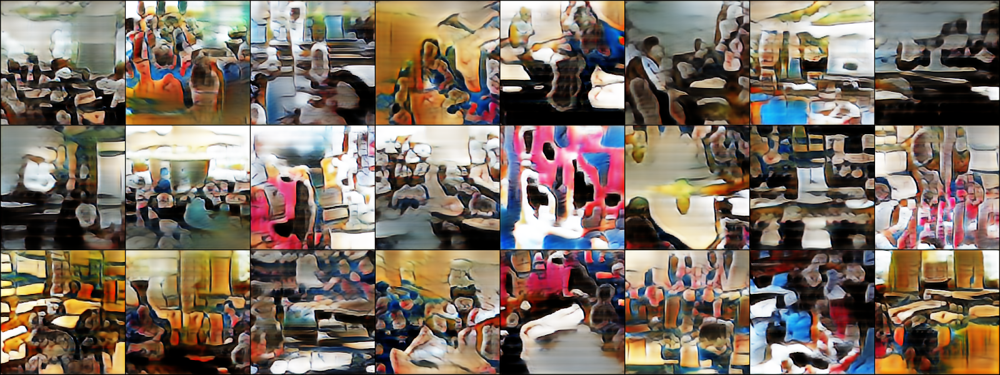
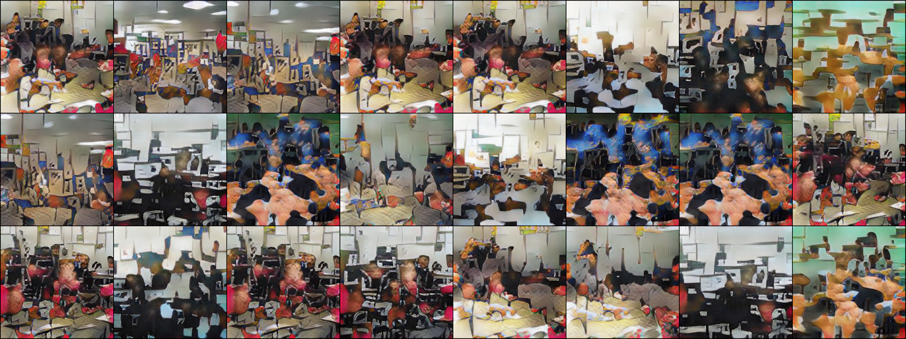

# UretGAN

The related paper can be found here: 
The collaborators of the project are Arda Tümay, Tolga Çatalpınar, Naci Dalkıran

# Aim
We aimed to improve StackGAN-v2 further to generate more accurate results in a different dataset that they used. We have produced a model based on StackGAN-v2 architecture.

# Dataset
LSUN Classroom Dataset can be installed on Google Colab by the following rows:
 !wget http://dl.yf.io/lsun/scenes/classroom_train_lmdb.zip
 !unzip /content/classroom_train_lmdb.zip

Then, create a folder in content directory named "lsun" and put the "classroom_train_lmdb" file into it.

# Training
The following row executes the training:
 !python2.7 '[DIR_TO_FILE]/code/main.py' --cfg '[DIR_TO_FILE]/code/cfg/classroom_3stages_color.yml' --gpu 0
Note that DIR_TO_FILE is the directory of the file - either the original StackGAN-v2's or our model's file- and don't include the file's name in the path.

# Test Results
We first trained the StackGAN-v2 with CUB dataset, which was also the dataset of the implementers of StackGAN-v2 has used in their paper results. Then, we tested the original architecture with LSUN classroom dataset. After getting the results, we tested the same dataset with our model. Since the training time of the model require many hours, we focused on results from small number of epochs. In addition to that, we also trained MobileNet-v2 with CelebA dataset for performance comparison. The corresponding results we obtained are below.

# Original StackGAN-v2 With CUB Dataset

# Original StackGAN-v2 With LSUN Classroom Dataset

# Our Model With LSUN Classroom Dataset
On the first epoch

On the fourth epoch

